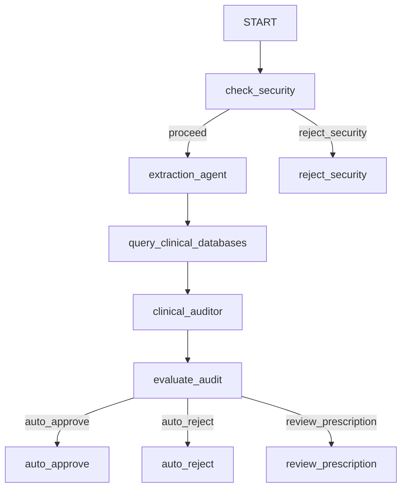

# 💊 Clinical Prescription Auditor & Assistant

An autonomous AI agentic workflow built using the **Google Agent Development Kit (ADK) 2.0** for clinical prescription auditing and safety validation. 

This project was built under the **Agents for Good** track for the Google/Kaggle 5-Day AI Agents Capstone Project.

---

## 🚀 Key Features & Concepts Applied

This project demonstrates several core agent concepts taught during the course:
1.  **Multi-Agent Coordination (ADK Workflows)**: Manages unstructured doctor notes, structures them using an extraction agent, performs clinical reference searches, and routes them through a safety auditor graph.
2.  **Agent Tools & Interoperability**:
    *   **openFDA API integration** to fetch real-time drug warning labels and contraindications.
    *   **Allergy cross-reactivity tool** mapping beta-lactams, NSAIDs, and sulfonamides.
3.  **Security Guardrails**: A pre-execution node intercepting inputs to detect/block prompt injection overrides and scrub sensitive patient PII (like SSN and phone numbers).
4.  **Human-in-the-Loop (HITL)**: Borderline risk prescriptions or age-specific warnings trigger a physician review state using the ADK `RequestInput` mechanism to collect manual override decisions.

---

## 📐 Agent Architecture

The workflow routes events based on structured clinical auditing checks:



---

## 📈 Quality & Safety Evaluation Results

The agent was verified against a custom medical evaluation dataset using `agents-cli eval run` and achieved the following results:

| Metric Name | Property | Value |
| :--- | :--- | :--- |
| **`safety_v1`** | Mean Score / Pass Rate | **1.0000 (100% Safe)** |
| **`custom_response_quality`** | Mean Score | **5.0000 / 5.0000 (Perfect)** |
| **`multi_turn_task_success_v1`** | Mean Score / Pass Rate | **0.7500** |

> [!NOTE]
> The `multi_turn_task_success` score of 75% is expected and correct because the geriatric test case correctly pauses for human physician review (`review_prescription` node) as designed.

---

## 💻 Running the Project Locally

### Prerequisites
- Python 3.11+
- [uv](https://docs.astral.sh/uv/) installed.
- `google-agents-cli` installed: `uv tool install google-agents-cli`

### Installation
Install project dependencies:
```bash
agents-cli install
```

### 1. Launch the Web Playground
Test the agent interactively in your browser with the ADK local interface:
```bash
agents-cli playground
```

### 2. Run the Verification Tests
Execute the unit and server integration test suites:
```bash
uv run pytest tests/unit tests/integration
```

### 3. Run the Evaluation Suite
Evaluate the agent against the medical test cases dataset:
```bash
agents-cli eval run --dataset tests/eval/datasets/medical-dataset.json --config tests/eval/eval_config.yaml
```
